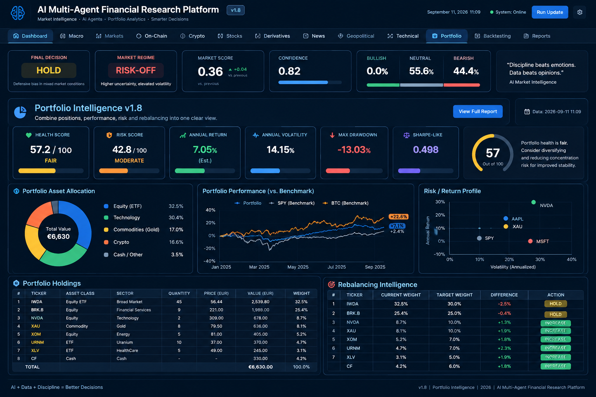

# AI Multi-Agent Financial Research Platform v1.8

## Portfolio Intelligence & Adaptive Financial Research

An advanced Python-based multi-agent financial research and decision-support platform combining AI agents, market intelligence, historical validation, adaptive learning, portfolio analytics, and autonomous financial research into a unified architecture.

Version **1.8** introduces a dedicated **Portfolio Intelligence Layer**, extending the platform from market analysis into portfolio optimization, diversification, risk management, performance monitoring, and intelligent rebalancing.

---

# Financial Intelligence Dashboard

---

# Key Features

- Multi-Agent AI Architecture
- Portfolio Intelligence Layer
- Market Intelligence Engine
- Adaptive Learning
- Historical Validation
- Backtesting Framework
- Risk Analytics
- Portfolio Optimization
- Diversification Analysis
- Rebalancing Intelligence
- Technical Analysis
- Macro Economic Analysis
- Cryptocurrency Intelligence
- AI Decision Support
- Explainable AI
- Modular Python Architecture

---

# Portfolio Intelligence

The Portfolio Intelligence Layer continuously evaluates investment portfolios by combining AI reasoning with quantitative analytics.

It measures:

- Portfolio Allocation
- Portfolio Risk
- Expected Return
- Volatility
- Sharpe Ratio
- Maximum Drawdown
- Diversification
- Position Concentration
- Correlation Analysis
- Rebalancing Opportunities

---

# AI Agents

The platform is designed around specialized AI agents including:

- Market Research Agent
- Portfolio Intelligence Agent
- Technical Analysis Agent
- Fundamental Analysis Agent
- Risk Management Agent
- Macro Intelligence Agent
- Cryptocurrency Intelligence Agent
- News Intelligence Agent
- Learning & Validation Agent

Each agent contributes independent analysis before producing a combined investment assessment.

---

# Technologies

- Python
- OpenAI
- LangChain
- Pandas
- NumPy
- Plotly
- Matplotlib
- Requests
- FastAPI
- Docker
- GitHub
- VS Code

---

# Current Development

Current Version

**v1.8**

Main focus:

- Portfolio Intelligence
- AI Decision Layer
- Adaptive Learning
- Multi-Agent Collaboration
- Financial Dashboard
- Historical Validation
- Autonomous Research

---

# Future Roadmap

- Real-Time Market Streaming
- Reinforcement Learning
- Autonomous Portfolio Management
- Institutional Risk Models
- Options Analytics
- On-Chain Intelligence
- Quantum Portfolio Optimization
- AI Trading Assistant
- Multi-Broker Integration
- Cloud Deployment

---

# Project Status

Active Development

This project is continuously expanded with new AI capabilities focused on professional financial research and intelligent investment decision support.

---

# Author

**Tamás Németh**

AI • Multi-Agent Systems • Financial Intelligence • Python • Machine Learning • Blockchain • Cryptocurrency • Portfolio Analytics • Quantum Computing
